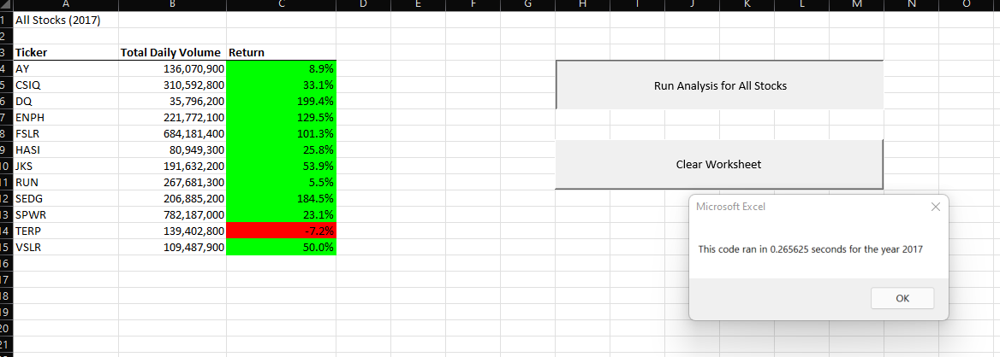
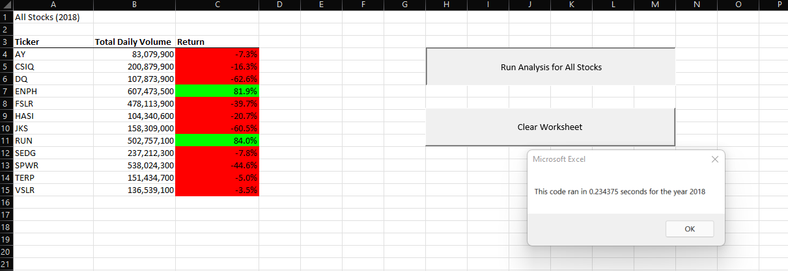

# stock-analysis
Stock Analysis utilizing VBA

## Project Overview

Our client, Steve, inquired about stock return values. We ran a report outlining the return on total daily
volume for 12 stocks requested. This anaylsis was designed to identify successful return, revealing 
which stock would be the best for investment.

## Project Results

We find two superior stocks RUN and ENPH, it is clear in running this analysis that the stock with the best potential 
for return is ENPH. Where as it did not have the highest return in 2017, it was still over 100%, as well as an 81.9%
return in 2018. 

Our original code helps to output the same data but in a far slower run time. With the new run code we find it is
exponentially faster. Original code run time for 2017 is 2.2 seconds and 2018 is 4.3 seconds with a refactored code
as seen below we are a fraction of a second.

#### 2017 Stock Analysis

#### 2018 Stock Analysis

## Project Summary

- **Advantages**: Code prior to refactoring takes slightly longer to run, by refactoring the code
we were able to see a fraction of a second return. This allows for immediate display with no screen interruption.
- **Disadvantages**: It may take longer to test the refactored code to ensure it is running properly. Refactoring, while more 
efficient in time of execution, may take longer to develop and debug with a larger data set.
